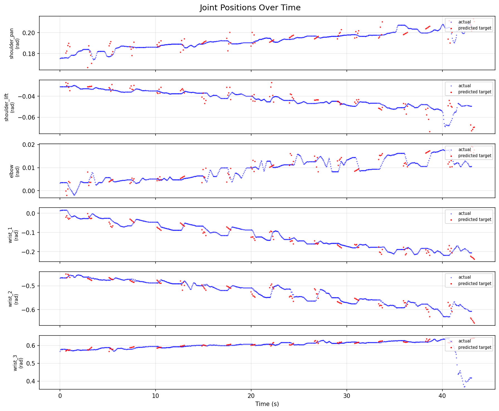
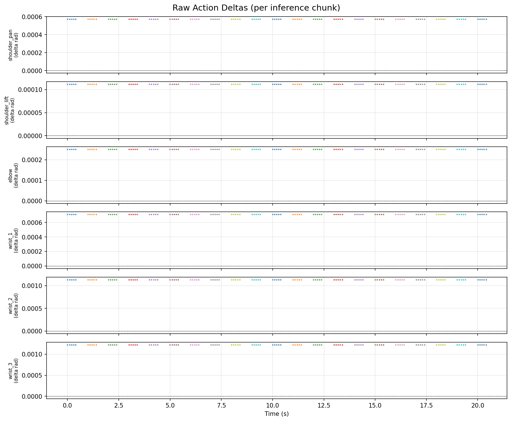
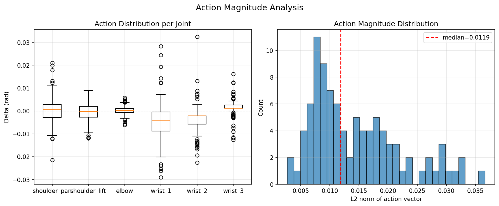
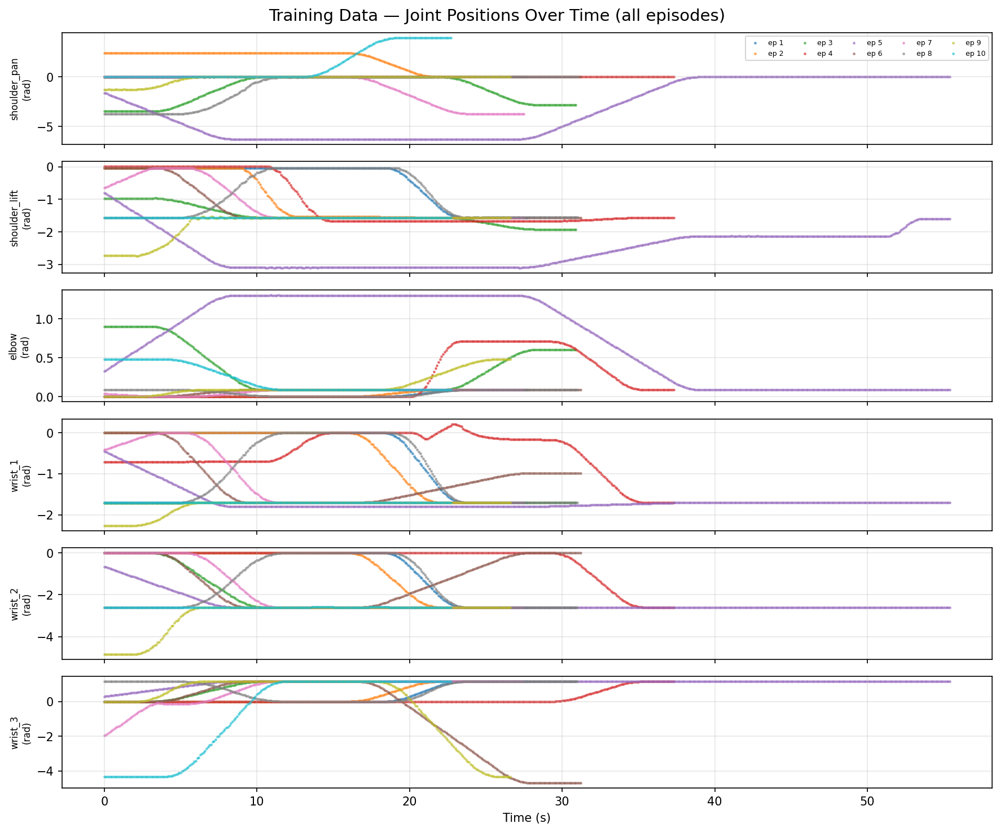
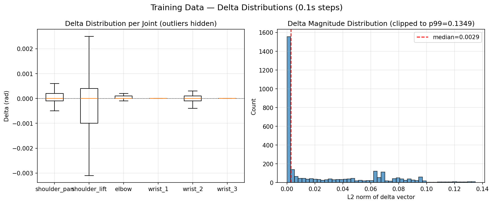
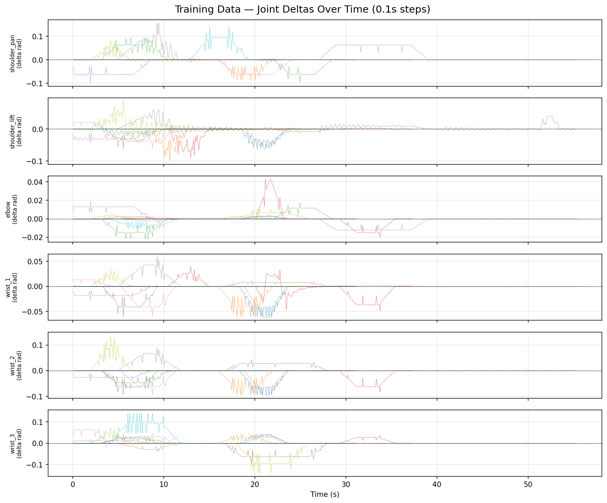

# Model Finetuning Eval Datadump

**Date:** March 22, 2026
**Purpose:** Record all fine-tuning evaluation outputs, analysis, and commentary for research paper reference.

---

## Background

We are fine-tuning a **pi0-FAST** Vision-Language-Action (VLA) model to control a **UR5e** robotic arm in **Isaac Sim** via ROS2. The model takes camera images + joint states + a language prompt, and outputs delta joint angle commands.

### Pipeline

```
Isaac Sim → ROS2 topics → vla_controller_node → WebSocket → OpenPI server (pi0-FAST) → action chunk → arm
```

### Model Architecture

- **Base model:** pi0-FAST (Physical Intelligence), PaliGemma 2B backbone
- **Fine-tuning method:** LoRA on gemma_2b (frozen base weights, trainable LoRA adapters)
- **Action tokenization:** FAST — Discrete Cosine Transform (DCT) → quantization → Byte Pair Encoding (BPE) compression → autoregressive token generation
- **Action space:** 8D (6 UR5e joints + 1 zero-pad + 1 gripper), delta joint angles in radians
- **Action horizon:** 10 timesteps per inference chunk
- **Training data:** `sheilsarda/ur5_isaac_sim_v1` (LeRobot format), demonstrations of "lift the arm up" in Isaac Sim

### Key Issue Encountered: FAST Token Decode Failures

Before evaluation could begin, we hit a 100% decode failure rate. The FAST tokenization pipeline produces variable-length Byte Pair Encoding (BPE) token sequences. When the model generates tokens at inference time, the BPE-decoded character string must be exactly `action_horizon × action_dim = 10 × 8 = 80` characters to reshape into a valid action chunk. At 10k training steps (CE loss ~0.13, still decreasing), the model produces token sequences that decode to nearby but incorrect lengths (67–96 characters instead of 80).

**Root cause:** The HuggingFace `UniversalActionProcessor.decode()` does a hard `reshape(-1, action_dim)` with no tolerance for length mismatches, unlike the LeRobot implementation which has a `relaxed_decoding` mode.

**Fix applied:** Patched `openpi/src/openpi/models/tokenizer.py` to pad/truncate DCT coefficients to the expected length before reshape. Truncation drops high-frequency DCT components (least important); zero-padding assumes no high-frequency content. Both are benign approximations.

Full details: `thoughts/FAST Token Decoding Failure Root Cause and Fix Plan 032226.md`

---

## Eval Run 1 — First dry-run after relaxed decoding patch

**Date/Time:** 2026-03-22 16:11:05
**Bag Path:** `training_data/eval_runs/eval_20260322_161105`
**Checkpoint:** `sheilsarda/pi0_ur5_fast_v1` (step 9999)
**Model Config:** `pi0_ur5` — Pi0-FAST, LoRA, action_dim=8, action_horizon=10
**Controller Config:** dry_run=true, action_mode=delta, action_scale=1.0, open_loop_horizon=5, waypoint_dt=0.1
**Task Prompt:** "pick up the block"

### Context

This is the first successful inference after applying the relaxed decoding patch. Prior to this, every inference returned all-zero actions due to reshape failures in the FAST tokenizer decode path.

### Raw Output

```
[INFO] [viz_dry_run]: Data collected: 176 joint states, 3 action chunks, 3 target chunks

=== Action Summary ===
Total chunks: 3
Total action steps: 15
Action magnitude — median: 0.0140, mean: 0.0176, max: 0.0472
Per-joint mean deltas: [ 0.0005716   0.00018759  0.00072129 -0.00916171  0.00113413  0.00139095]
Per-joint std deltas:  [0.         0.00187104 0.00320231 0.0184934  0.0026707  0.00358595]
```

### Commentary

**The model is producing real, physically meaningful actions.** This is a significant milestone — it confirms the full pipeline works end-to-end: Isaac Sim cameras → ROS2 → VLA controller → OpenPI server → pi0-FAST inference → action decode → joint deltas.

**Action magnitudes are in the right ballpark.** The median action magnitude of 0.014 radians (~0.8 degrees) per timestep is consistent with fine manipulation — not so large as to cause violent motion, not so small as to be noise. The max of 0.047 radians (~2.7 degrees) is still well within safe operating bounds for the UR5e.

**The model has joint-specific behavior, not just uniform noise.** If the model were producing random output, we'd expect roughly equal magnitudes and variances across all 6 joints. Instead:

| Joint | Mean Delta (rad) | Std (rad) | Interpretation |
|---|---|---|---|
| shoulder_pan | 0.00057 | 0.00000 | Effectively constant — model doesn't vary this joint |
| shoulder_lift | 0.00019 | 0.00187 | Very small motion |
| elbow | 0.00072 | 0.00320 | Small motion |
| **wrist_1** | **-0.00916** | **0.01849** | **Dominant joint — model learned this matters most** |
| wrist_2 | 0.00113 | 0.00267 | Small motion |
| wrist_3 | 0.00139 | 0.00359 | Small motion |

The dominance of wrist_1 is interesting. For a "pick up the block" task, wrist orientation is indeed critical for approach — this suggests the model has learned something meaningful about the task structure, even at only 10k training steps.

**The zero-variance on shoulder_pan is concerning.** It likely means the DCT coefficients for that joint dimension are being truncated/padded in a way that collapses them to a constant, or the model hasn't learned to vary the base joint. This should improve with more training.

**Only 3 inference chunks in ~6 seconds is low but expected.** Each chunk covers 5 steps × 0.1s = 0.5s of execution time. With inference latency on top (~1-2s per inference on the current GPU), 3 chunks in 6 seconds is reasonable. The inference cadence will improve with a faster GPU or when running the model on dedicated hardware.

### Training State at Time of Eval

| Parameter | Value |
|---|---|
| Training steps completed | 10,000 |
| CE loss at step 7.5k | ~0.19 |
| CE loss at step 10k | ~0.13 (still decreasing) |
| Loss trend | Clearly not plateaued |
| Batch size | 16 |
| Effective samples seen | 160,000 (10k steps × 16 batch) |
| Base checkpoint | `gs://openpi-assets/checkpoints/pi0_fast_base/params` |
| Dataset | `sheilsarda/ur5_isaac_sim_v1` |
| W&B run ID | `dtoe5fhc` |
| W&B URL | `wandb.ai/sheilsarda/openpi/runs/dtoe5fhc` |

---

## Eval Run 2 — Longer run, "move the arm up" task, same checkpoint

**Date/Time:** 2026-03-22 16:15:08
**Bag Path:** `training_data/eval_runs/eval_20260322_161508`
**Checkpoint:** `sheilsarda/pi0_ur5_fast_v1` (step 9999, CE loss ~0.13)
**Model Config:** `pi0_ur5` — Pi0-FAST, LoRA, action_dim=8, action_horizon=10
**Controller Config:** dry_run=false (live), action_mode=delta, action_scale=1.0, open_loop_horizon=5, waypoint_dt=0.1
**Task Prompt:** "move the arm up"

### Raw Output

```
[INFO] [viz_dry_run]: Data collected: 1479 joint states, 19 action chunks, 19 target chunks

=== Action Summary ===
Total chunks: 19
Total action steps: 95
Action magnitude — median: 0.0119, mean: 0.0144, max: 0.0366
Per-joint mean deltas: [ 0.00067263 -0.00045258  0.00027294 -0.00470189 -0.0036581   0.00119332]
Per-joint std deltas:  [0.00656161 0.00420713 0.00212963 0.00973055 0.00714096 0.00422311]
```

### Plots







### Commentary

**The arm moved, but in the wrong direction.** This was a live run (dry_run=false) — actions were sent to the arm. Over ~45 seconds and 19 inference chunks (95 action steps), the joints drifted slowly downward: shoulder_lift from -0.03 to -0.07 rad, wrist_1 from 0.0 to -0.3 rad, wrist_2 from -0.45 to -0.65 rad. The motion is small, slow, and in the **opposite direction** of "move the arm up." The predicted targets (red dots) scatter erratically near the current position rather than tracing a coherent upward trajectory.

#### Why the arm moved down instead of up: actions are too small and directionless

| Joint | Mean Delta (rad) | Std (rad) | Expected for "move up" |
|---|---|---|---|
| shoulder_pan | 0.00067 | 0.00656 | ~0 (base rotation not needed) |
| shoulder_lift | **-0.00045** | 0.00421 | **Large negative** (lift upper arm) |
| elbow | 0.00027 | 0.00213 | Moderate (extend/flex) |
| wrist_1 | -0.00470 | 0.00973 | Small (maintain orientation) |
| wrist_2 | -0.00366 | 0.00714 | Small |
| wrist_3 | 0.00119 | 0.00422 | Small |

The critical signal: **shoulder_lift mean is -0.00045 rad/step**. To "move the arm up," shoulder_lift should be the dominant joint with consistent large negative deltas (on the order of -0.01 to -0.05 rad/step). Instead, the mean is essentially zero — the model isn't commanding upward motion. For every step that pushes shoulder_lift down, another pushes it back up, resulting in no net movement.

#### Comparison to Eval Run 1

| Metric | Run 1 (3 chunks) | Run 2 (19 chunks) | Trend |
|---|---|---|---|
| Median action magnitude | 0.0140 | 0.0119 | Slightly smaller |
| Max action magnitude | 0.0472 | 0.0366 | Smaller |
| Dominant joint | wrist_1 (-0.009) | wrist_1 (-0.005) | Still dominant but weaker |
| shoulder_pan std | 0.000 (constant) | 0.007 | Now varies (improvement) |
| Inference count | 3 chunks / 6s | 19 chunks / 45s | Consistent ~2.4s/chunk |

With 6× more data, the trends from Run 1 are confirmed: the model outputs small, oscillatory deltas centered near zero. The downward drift visible in the joint position plot is likely gravity — the model's near-zero commands provide almost no resistance, so the arm slowly sags under its own weight.

#### Diagnosis: the model is under-trained

The Action Magnitude Distribution histogram tells the story. The L2 norms cluster tightly between 0.005–0.015 rad with a median of 0.012. This is the hallmark of a model that has learned to **not output garbage** (it's producing plausible-magnitude actions, not random large values) but has **not yet learned task-directed behavior** (it doesn't know what "move the arm up" means in terms of specific joint deltas).

At 10k training steps with CE loss still at ~0.13 and clearly decreasing, the model is in an intermediate state:
- **Learned:** approximate magnitude range for actions, joint-specific variance patterns
- **Not learned:** mapping from language instruction → directional joint commands, temporal coherence across chunks

The Raw Action Deltas plot confirms this — each inference chunk produces a small burst of deltas that oscillate around zero with no consistent direction across chunks. The model is "hedging" by predicting near-zero actions, which minimizes its loss on average but doesn't accomplish any task. With dry_run=false, these near-zero actions result in the arm slowly drifting under gravity rather than executing purposeful motion.

### Training State at Time of Eval

(Same checkpoint as Eval Run 1 — no additional training between runs.)

| Parameter | Value |
|---|---|
| Training steps completed | 10,000 |
| CE loss at step 10k | ~0.13 (still decreasing) |
| Loss trend | Not plateaued |
| Base checkpoint | `gs://openpi-assets/checkpoints/pi0_fast_base/params` |
| Dataset | `sheilsarda/ur5_isaac_sim_v1` |
| W&B run ID | `dtoe5fhc` |

---

## Eval Run 3 — (template for next run)

**Date/Time:**
**Bag Path:**
**Checkpoint:** (step count and CE loss)
**Task Prompt:**
**Notes:**

```
(paste raw output here)
```

### Commentary

(analysis goes here)

---

## Summary Table (update after each eval)

| Run | Date | Checkpoint Step | CE Loss | Median Action Mag | Max Action Mag | Non-Zero Joints | Notes |
|---|---|---|---|---|---|---|---|
| 1 | 2026-03-22 | 9999 | ~0.13 | 0.0140 | 0.0472 | 5/6 (shoulder_pan constant) | First successful inference post-patch |
| 2 | 2026-03-22 | 9999 | ~0.13 | 0.0119 | 0.0366 | 6/6 | 19 chunks over 45s — no directional motion, model hedging |

---

## Changelog

| Date | Event |
|---|---|
| 2026-03-22 | Relaxed decoding patch applied to `openpi/src/openpi/models/tokenizer.py`. |
| 2026-03-22 | First successful non-zero inference (Eval Run 1). |
| 2026-03-22 | `eval_recorder` evaluation tool built — records rosbag + produces diagnostic plots. |
| 2026-03-22 | Training resumed toward 20-30k steps on Colab A100 (pending). |
| 2026-03-22 | Eval Run 2 — longer run confirms model outputs small directionless deltas. Under-trained at 10k steps. |

---

## Training Data Analysis — Ground-Truth Demonstration Deltas

**Date:** 2026-03-27
**Episodes:** episode_001 through episode_010 (10 total)
**Task:** "lift the arm up"
**Total Samples (resampled at 0.1s):** 3,310
**Total Delta Samples:** 3,300

> Positions are resampled from raw bag data to 0.1s intervals via nearest-neighbor
> lookup. This matches the eval waypoint cadence, so deltas are directly comparable
> without normalization.

### Per-Joint Delta Statistics (across all 10 episodes)

| Joint | Mean Delta (rad) | Std (rad) |
|---|---|---|
| shoulder_pan | 0.003049 | 0.288824 |
| shoulder_lift | 0.003736 | 0.260506 |
| elbow | -0.005701 | 0.347824 |
| wrist_1 | 0.000459 | 0.341768 |
| wrist_2 | 0.001242 | 0.258098 |
| wrist_3 | -0.006545 | 0.565689 |

**Magnitude summary:** median=0.0119, mean=0.1318, max=12.2913

### Comparison: Training Deltas vs Model Output (Eval Run 2)

| Joint | Training Mean | Training Std | Eval Run 2 Mean | Eval Run 2 Std | Mean Ratio |
|---|---|---|---|---|---|
| shoulder_pan | 0.003049 | 0.288824 | 0.000673 | 0.006562 | 0.2x |
| shoulder_lift | 0.003736 | 0.260506 | -0.000453 | 0.004207 | -0.1x |
| elbow | -0.005701 | 0.347824 | 0.000273 | 0.002130 | -0.0x |
| wrist_1 | 0.000459 | 0.341768 | -0.004702 | 0.009731 | -10.3x |
| wrist_2 | 0.001242 | 0.258098 | -0.003658 | 0.007141 | -2.9x |
| wrist_3 | -0.006545 | 0.565689 | 0.001193 | 0.004223 | -0.2x |

### Plots






